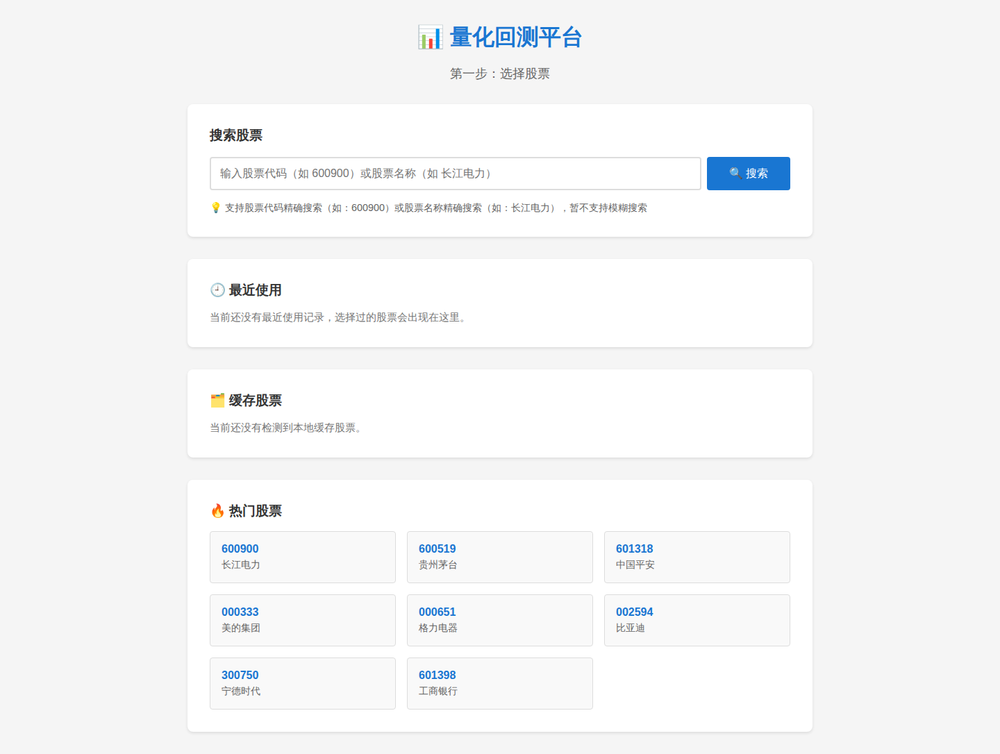
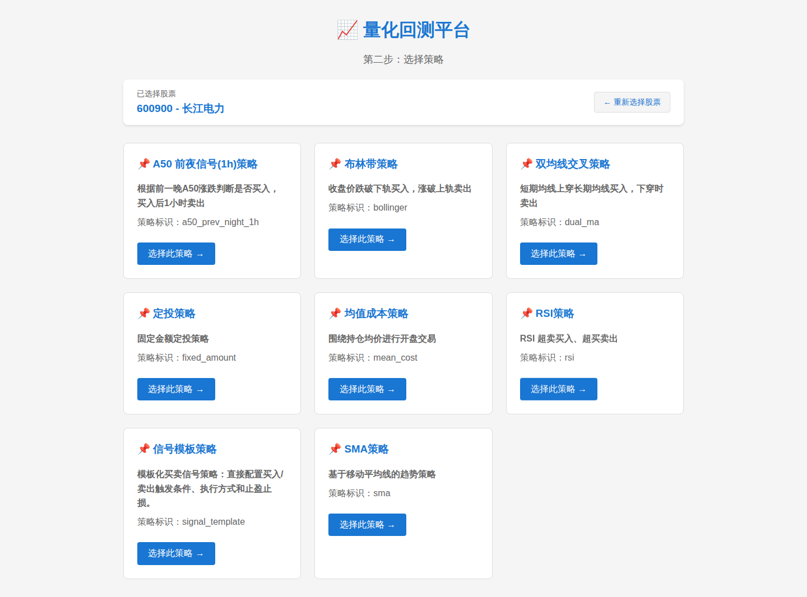
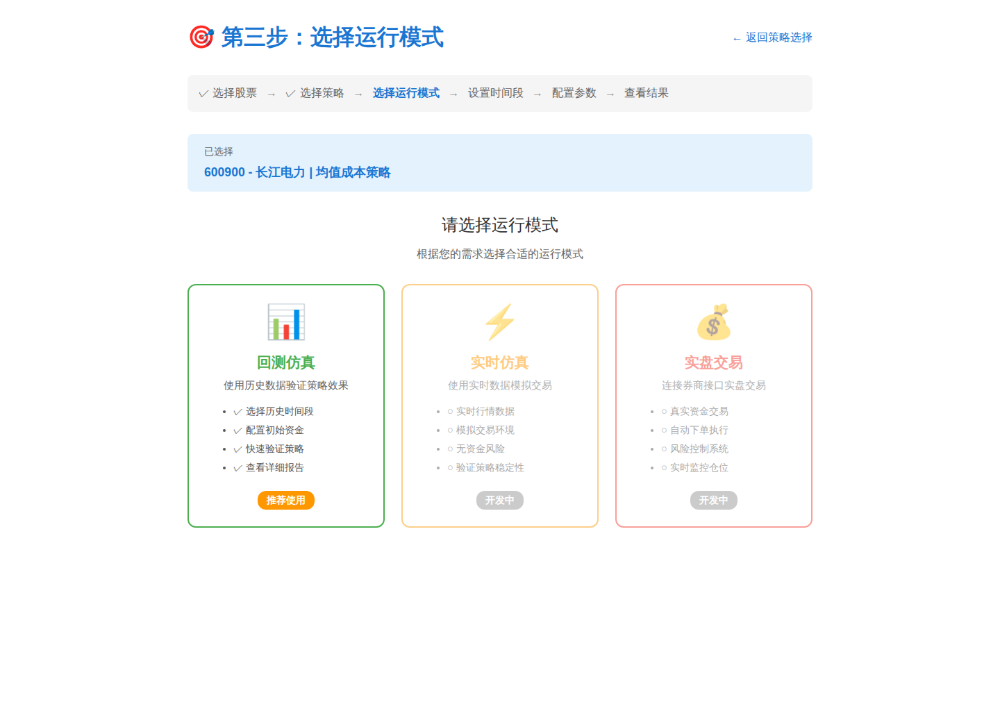
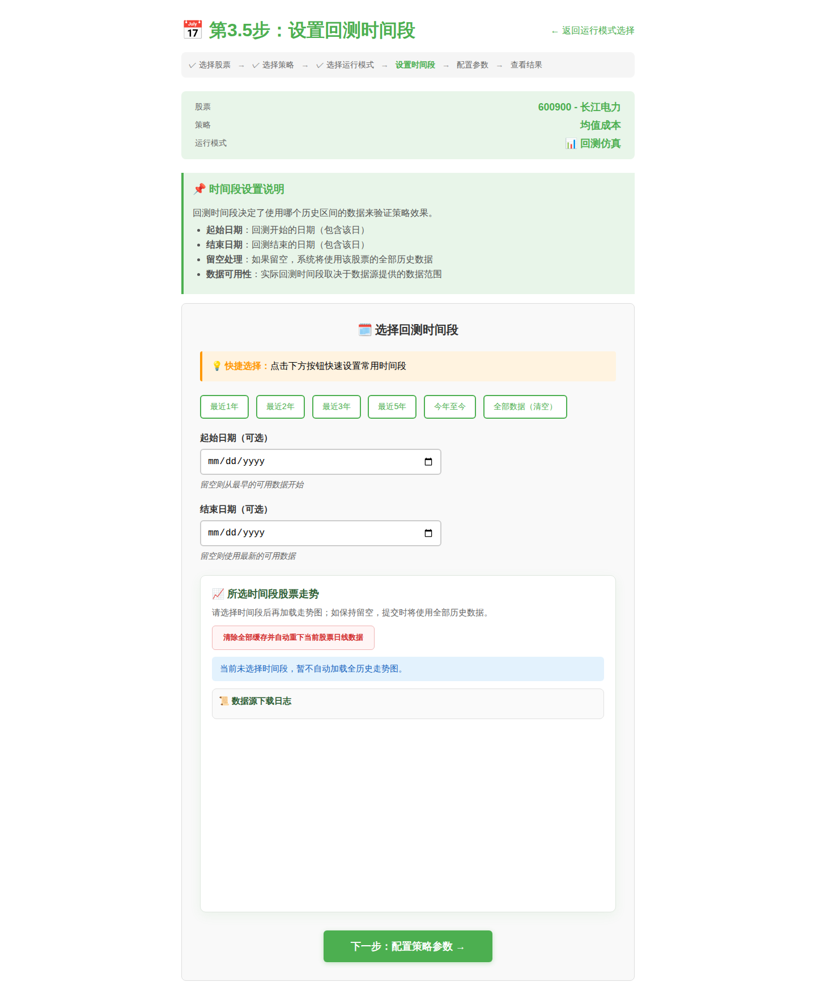
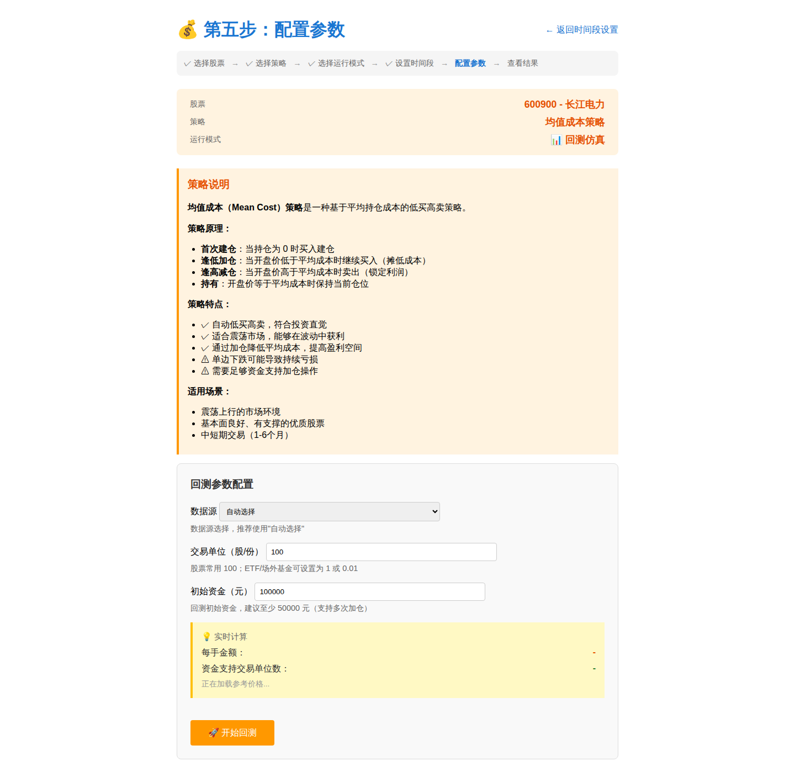
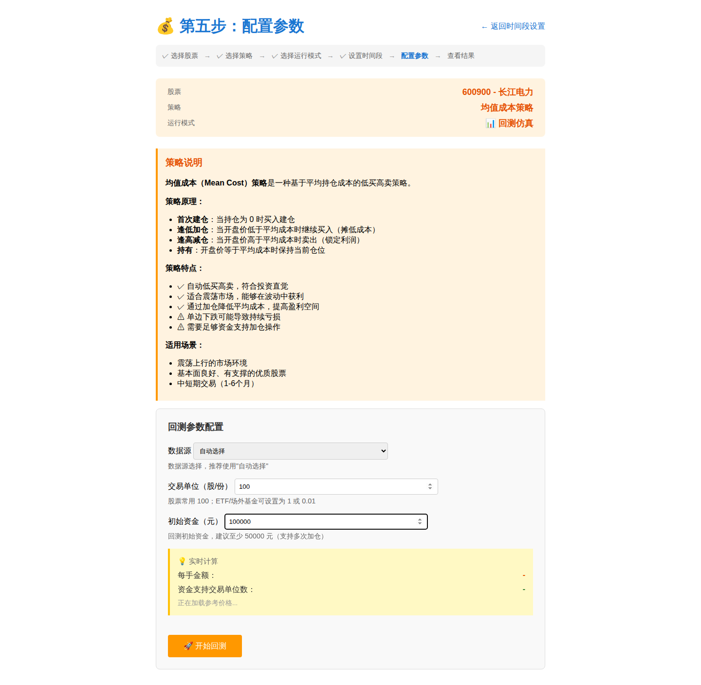
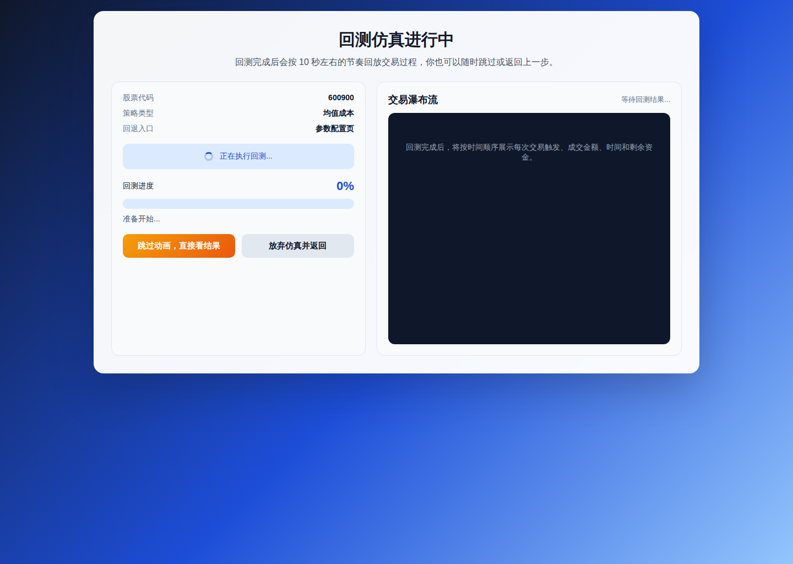
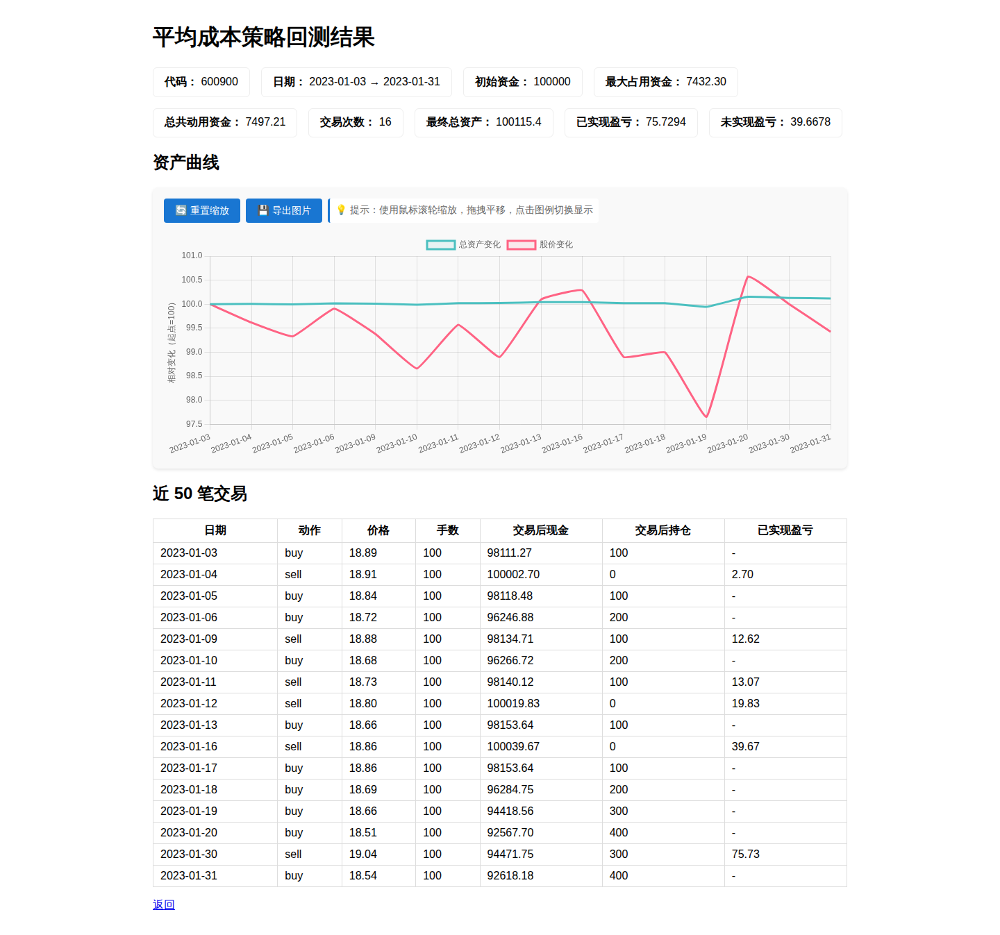

# GUI 量化回测测试报告

## 测试结论

- 结果：成功完成一次浏览器端量化回测
- 股票：600900 长江电力
- 策略：均值成本策略
- 模式：回测仿真
- 时间范围：2023-01-01 至 2023-01-31
- 执行时间：2026-06-15 10:02:17
- 产物目录：testing

## 测试步骤

### 步骤 1：打开首页

进入量化回测首页，确认股票搜索框与热门股票区域可见。

### 步骤 2：选择股票

搜索 600900 并确认跳转到策略选择页。

### 步骤 3：选择策略

选择均值成本策略，进入运行模式选择页。

### 步骤 4：选择运行模式

选择回测仿真模式，进入时间范围设置页。

### 步骤 5：设置回测时间段

设置 2023-01-01 到 2023-01-31 的回测区间，并进入策略参数页。

### 步骤 6：配置策略参数

使用自动数据源、每手 100 股、初始资金 100000 元，并确认实时计算区域正常显示。

### 步骤 7：运行回测

提交参数后进入回测进度页，确认进度展示页面、跳过按钮和交易瀑布流正常加载。

### 步骤 8：查看回测结果

回测完成后进入结果页，确认资产曲线图和结果摘要已经展示。

## 结果摘要

- 代码： 600900
- 日期： 2023-01-03 → 2023-01-31
- 初始资金： 100000
- 最大占用资金： 7432.30
- 总共动用资金： 7497.21
- 交易次数： 16
- 最终总资产： 100115.4
- 已实现盈亏： 75.7294
- 未实现盈亏： 39.6678

## 验收说明

- 所有截图均由 Playwright 在 Chromium 浏览器中完成并保存在 testing 目录。
- 报告内容可直接作为 PR 评论正文使用。